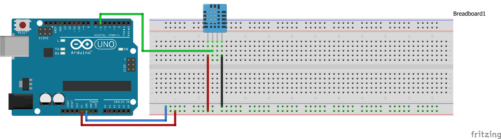
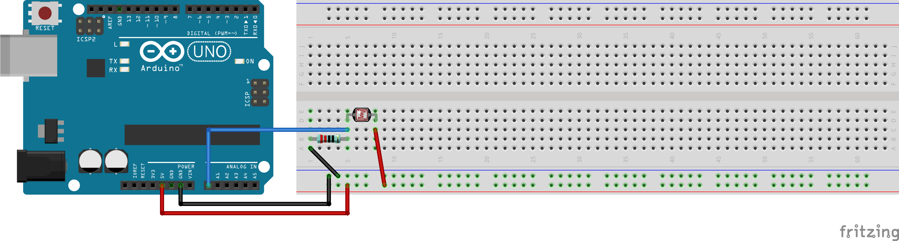
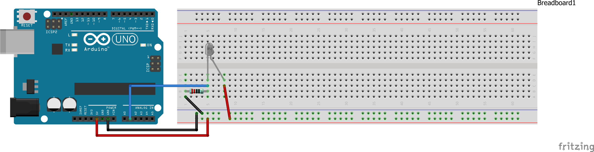
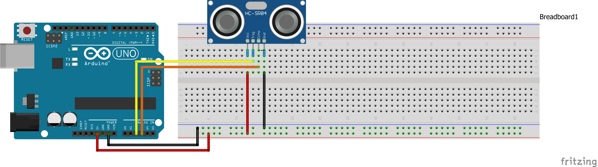
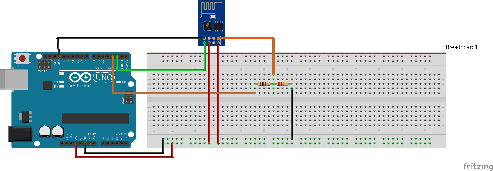
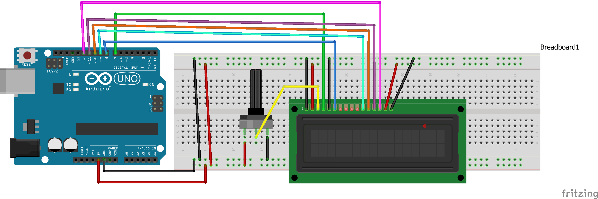
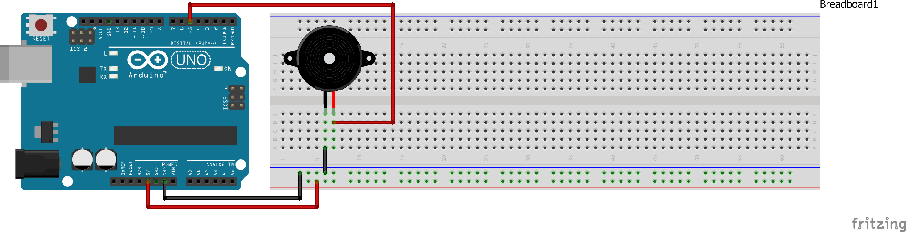
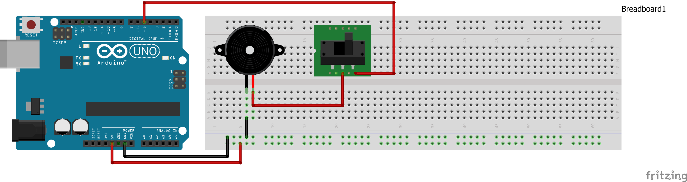

# The-Third-Eye - A Home Monitoring System
The project Third-Eye is an Arduino based smart home monitoring system. It is designed as an academic project for Interactive Hardware-CS807. For the project purpose we used components that were relatively cheap and readily available in our arduino kit. The system can monitor Temperature, Humidity, detect light, motion and fire. All these sensored data are collected and sent to a remote server where anyone from anywhere can monitor sensor activities through a web page or a mobile application.

## Key Features
 1. Measure room temperature.
 2. Measure room humidity.
 3. Can detect light in the room.
 4. Can detect motion in the room.
 5. Can sense fire in the room.
 6. Can Display Temperature and Humidity
 7. An Alarm is triggered in the case of fire.
 8. The Fire Alarm can be turned off or on with a switch.
 9. All these activities and changes can be viewed via a web page or mobile application from any where in the world.

## Components Used 

The following components were used in our project
<pre>
 1.  One DHT 11 Sensor  2.  One Photoresistor  3.  One IR Flame Detector  4.  One Ultrasonic Range Finder
 5.  One ESP8266 WiFi Shield  6.  One LCD Panel  7.  One Piezo Buzzer  8.  One Slider  Switch
 9.  Bunch of Jumper Wires  10. Bunch of Resistors  11. One Web Server  12. Mobile App and Web Page
</pre>

## 

## Scematics & Design Diagram
Connecting all these components is tedious work. We believe it will be very difficult to follow if all of them are placed in one schematic diagram. For ease of implementation, we add individual component connection in breadboard view.

Bellow diagram shows the connection of DHT11 sensor :

For Photoresistor :

For IR Flame detector:

For Ultrasonic Range Finder:

For WiFi Shield:

For LCD Panel:

For Piezo Buzzer :

For Button :

For Arduino Sketch:

To work with own server and wifi hotspot, some parameters need to be changed. In src/ThirdEye.ino file please change the following 
<pre>
String AP = "SSID";       
String PASS = "PASSWORD"; 
String HOST = "SERVER BASE URL";
String PORT = "80";
</pre>
## Mobile and Web view

For a demonstration of this project, we used freely available hosting cloud provided by 000webhost.com. To set up a free personal web serverplease visit 000webhost.com. Once server creation is done which is very easy, we uploaded the server script and MySql database. If you already have any domain and hosting, you can use that. However, you need to change some parameters in different files.

At first you need to create a MySql Database in web server cpanel. When database is ready, you can upload the sql file to create the data tables required.
File is located in 
######  src/database/ThirdEye.sql   

Some additional changes are also required.
Please change the following in 
###### src/webserver/library/databaseConfig.php file.
<pre>
DB::$host='localhost'; // change if required
DB::$user = 'DATABASE_USERNAME';
DB::$password = 'DATABASE_PASSWORD';
DB::$dbName = 'DATABASE_NAME';
</pre>

Please change the following in 
###### src/mobileapp/ThirdEye/app/src/main/java/com/smarthome/MainActivity.java file.
<pre>
String URL = "HOSTING_SERVER_BASE_URL";
</pre>

However, to use the mobile app you need to compile and package this as APK file.To know more about packaging APK files in Android IDE please refer to this link https://developer.android.com/studio/run

 
# Mobile view

# Web view

## Credit
This project uses following libraries

1. DHT Sensor Library - for DHT11 sensor.
2. Adafruit Unified Sensor Library - Dependent library for DHT sensor Library 
3. LiquidCrystal Library - for LCD panel
4. Software Serial Library - For ESP8266 Esp-01 WiFi Shield

## Contributor
 - A K M Nazmul Hasan
 - Syed Tasrif Ahmed
 - Tolu Fatoki
