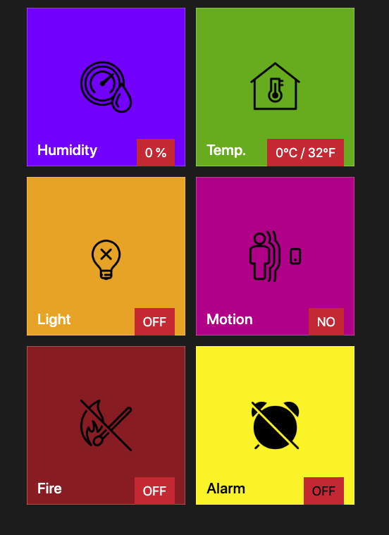
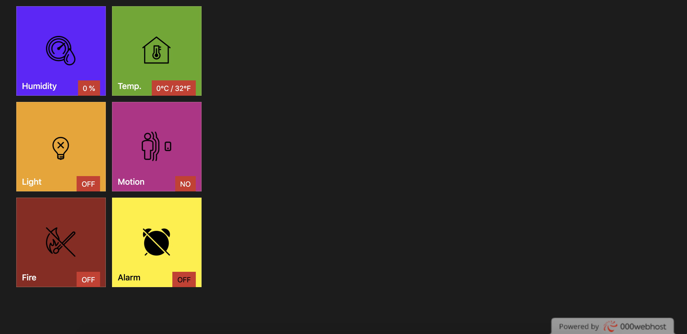

# The-Third-Eye - A Home Monitoring System
The project Third-Eye is an Arduino based smart home monitoring system. It is designed as an academic project for Interactive Hardware-CS807. For the project purpose we used components that were relatively cheap and readily available in our arduino kit. The system can monitor Temperature, Humidity, detect light, motion and fire. All these sensored data are collected and sent to a remote server where anyone from anywhere can monitor sensor activities through a web page or a mobile application.

## Key Features
 1. Measure room temperature.
 2. Measure room humidity.
 3. Can detect light in the room.
 4. Can detect motion in the room.
 5. Can sense fire in the room.
 6. Can Display Temperature and Humidity
 7. An Alarm is triggered in the case of fire.
 8. The Fire Alarm can be turned off or on with a switch.
 9. All these activities and changes can be viewed via a web page or mobile application from any where in the world.

## Components Used 

The following components were used in our project
------------ | -------------
  1.  One DHT 11 Sensor
 2.  One Photoresistor
 3.  One IR Flame Detector
 4.  One Ultrasonic Range Finder
 5.  One ESP8266 WiFi Shield
 6.  One LCD Panel
 7.  One Piezo Buzzer
 8.  One Slider  Switch
 9.  Bunch of Jumper Wires
 10. Bunch of Resistors
 11. One Web Server
 12. Mobile App and Web Page
|

## 

## Scematics & Design Diagram

## Mobile and Web view 
# Mobile view

# Web view

## Credit
This project uses following libraries

1. DHT Sensor Library
2. Adafruit Unified Sensor Library
3. LiquidCrystal Library
4. Software Serial Library

## Contributor
 - A K M Nazmul Hasan
 - Syed Tasrif Ahmed
 - Tolu Fatoki
